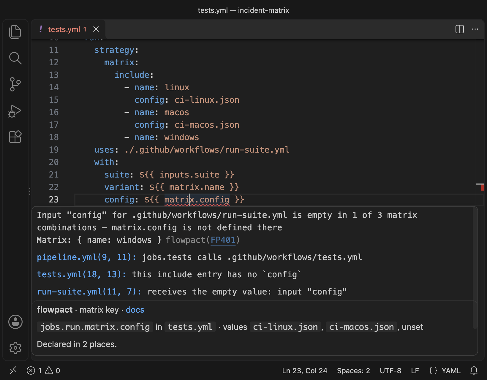

<h1 align="center">
  <picture>
    <source media="(prefers-color-scheme: dark)" srcset="assets/brand/wordmark-dark.svg">
    
  </picture>
</h1>

<p align="center">Find the GitHub Actions values that arrive empty while the run stays green.</p>

[](https://github.com/rumankazi/flowpact/actions/workflows/ci.yml)
[](https://github.com/rumankazi/flowpact/actions/workflows/release.yml)
[](https://github.com/marketplace/actions/flowpact)
[](https://www.npmjs.com/package/flowpact)
[](https://marketplace.visualstudio.com/items?itemName=flowpact.vscode-flowpact)
[](https://open-vsx.org/extension/flowpact/vscode-flowpact)
[](https://www.npmjs.com/package/flowpact)
[](https://scorecard.dev/viewer/?uri=github.com/rumankazi/flowpact)
[](LICENSE)
[](https://rumankazi.github.io/flowpact)

**Data-flow linter for GitHub Actions.**

GitHub Actions evaluates a missing matrix key, an undeclared secret or an optional input without a default to an empty
value: no error, no warning, a green run. When workflows call reusable workflows and local actions, that is how a test variant
or an upload stops running without anyone noticing. flowpact follows every input, secret, env var, matrix key and
output across those calls, evaluates every combination of the matrices written in your workflows, and reports where a
value goes missing. It runs as a CLI, a GitHub Action and a VS Code extension, and complements actionlint.


*The incident that started flowpact: one matrix entry had no `config`, so that test variant never ran. actionlint
reports nothing here.*

## Is this for me?

- **You call reusable workflows or local actions:** flowpact finds inputs callers do not pass, secrets that are never
  declared, and matrix values that are empty in some combinations.
- **You publish actions or reusable workflows that other repositories use,** in public or inside your organization:
  contracts flag breaking interface changes, and impact mode fails a pull request whose changes need a minor or major
  release when it declares less.
- **You edit workflows in VS Code:** the same findings as you type, with the
  [extension](https://marketplace.visualstudio.com/items?itemName=flowpact.vscode-flowpact).

It adds little to a few standalone workflows. Calls to reusable workflows in other repositories are reported as
unverified, not checked (cross-repository resolution is on the [roadmap](https://rumankazi.github.io/flowpact/docs/roadmap));
the repository that publishes them can still lint them and lock their interfaces with contracts.

## Get started

```sh
npx flowpact lint                       # lint .github/workflows and local actions
npx flowpact explain FP401              # why does this matter, how do I fix it?
npx flowpact trace pipeline.yml:config  # where does this input go?
```

In CI, add the action; it lints by default and annotates the pull request:

```yaml
- uses: actions/checkout@v7
- uses: rumankazi/flowpact@v0.7
```

📖 **Docs:** https://rumankazi.github.io/flowpact — getting started, how it works, the CLI (`generate`, `check`,
`graph`, `lsp`), CI and action usage, contracts, impact mode, configuration, and a page for every rule.

## What it finds that other tools miss

| Problem | actionlint | flowpact |
| --- | --- | --- |
| One matrix `include` entry lacks a key that is passed to a reusable workflow or action | — | `FP401`, naming the combination |
| An optional input with no default is left out, so a step is skipped or a required input further down is empty | — | `FP105`, `FP107` |
| A reusable workflow that declares no secrets reads one, and a caller does not use `secrets: inherit` | — | `FP205` |
| A step runs `./.github/actions/...` after checking the repository out into a subdirectory | — | `FP606` |
| A published workflow removes an output or renames a job, which can break consumers in other repositories | — | `FP803` (against the committed contracts), `FP810` (impact mode, against the base commit) |

In a large public repository, flowpact found the third case: a reusable workflow that reads `secrets.CODECOV_TOKEN`
while declaring no secrets, called from 31 places and none with `secrets: inherit`, so the token is always empty.

Both tools report a missing or unknown input on a direct call to a local reusable workflow or action, and actionlint
also checks shell scripts, runner labels, expression types and the inputs of popular actions such as
`actions/checkout`. Use flowpact next to it, and zizmor for security. The
[comparison](https://rumankazi.github.io/flowpact/docs/comparison) shows both tools' output side by side.

## For publishers of actions and reusable workflows

Other repositories pin your action or workflow to a tag such as `@v1`, and you cannot see their workflows or branch
protection. Remove an output of your action and their steps read an empty value; rename a job of a published reusable
workflow and their required check waits on *Expected — Waiting for status to be reported*.

With [impact mode](https://rumankazi.github.io/flowpact/docs/impact-mode) on (`impact: auto` in the action, on pull
requests), flowpact grades what each pull request changes for those consumers as major, minor, patch or none, and fails
when the pull request declares less than a minor or major change needs. By default the declaration is the Conventional
Commits title (`fix:` patch, `feat:` minor, `feat!:` major); labels can be used instead.

## Contracts

`flowpact generate` writes one contract per workflow and local action — inputs, secrets, outputs, what it calls and who
calls it — into `.github/flowpact/`. Contracts are generated only and deterministic (no hashes or
timestamps). `flowpact check` compares them with the workflows and reports missing, outdated, orphaned and invalid
contracts and **breaking** interface changes such as a removed output or a new required input. Contributors without
Node.js can apply the regenerated contracts from CI as a patch.


Findings you accept go into the config as **overrides** with a reason, an owner and an expiry date; expired overrides
bring the findings back.

## In your editor

The [VS Code extension](https://marketplace.visualstudio.com/items?itemName=flowpact.vscode-flowpact) (also on
[Open VSX](https://open-vsx.org/extension/flowpact/vscode-flowpact)) reports the same findings as you type, traces
inputs, secrets and outputs on hover, and goes to definitions and references across workflow calls. Other editors can
use the language server, `flowpact lsp` ([editors](https://rumankazi.github.io/flowpact/docs/editors)).



## Status

Shipped: the engine, 51 rules, contracts (`flowpact generate` / `flowpact check`), overrides with reason and expiry, plugins,
the CLI (pretty, JSON, Markdown and SARIF output; `flowpact graph`), the GitHub Action, a language server and the
[VS Code extension](https://marketplace.visualstudio.com/items?itemName=flowpact.vscode-flowpact) (diagnostics as you
type, hover traces, go to definition across workflow calls; also on
[Open VSX](https://open-vsx.org/extension/flowpact/vscode-flowpact)). Next: quick fixes in the editor, then
cross-repository resolution — see the [roadmap](https://rumankazi.github.io/flowpact/docs/roadmap).

## License

MIT
