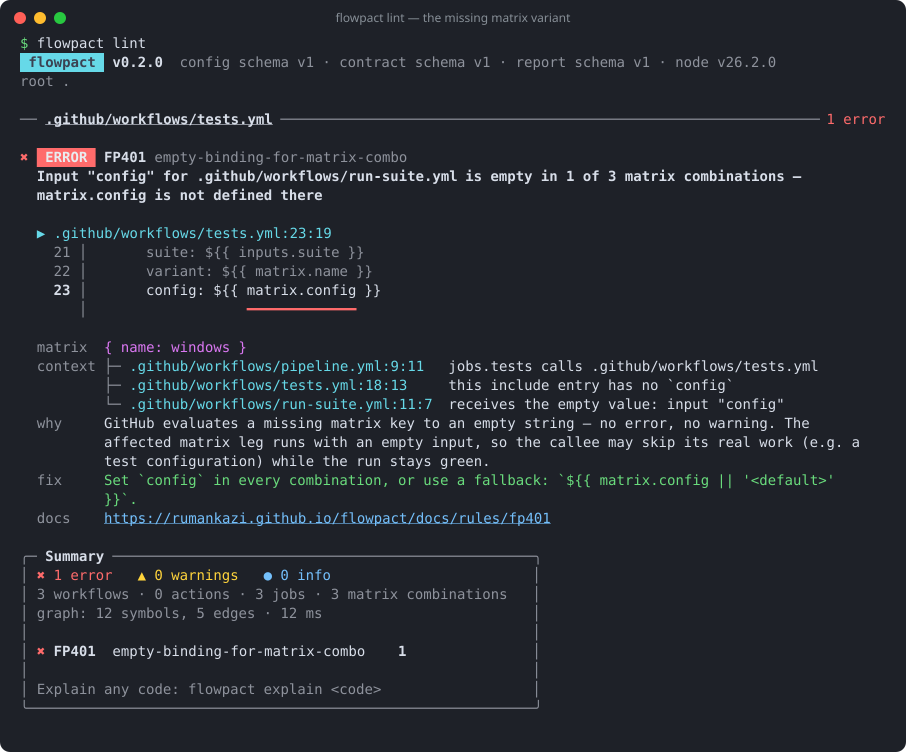
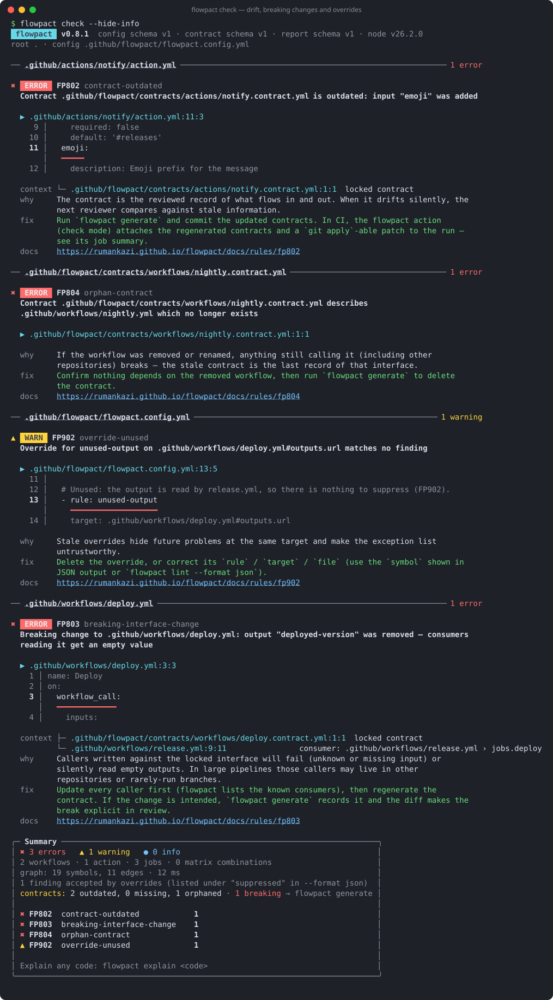

# flowpact — workflow contracts for GitHub Actions

[](https://github.com/rumankazi/flowpact/actions/workflows/ci.yml)
[](https://github.com/rumankazi/flowpact/actions/workflows/release.yml)
[](https://github.com/marketplace/actions/flowpact)
[](https://www.npmjs.com/package/flowpact)
[](https://www.npmjs.com/package/flowpact)
[](https://scorecard.dev/viewer/?uri=github.com/rumankazi/flowpact)
[](LICENSE)
[](https://rumankazi.github.io/flowpact)

**Lint, trace and lock the data flow between your GitHub Actions workflows.**

flowpact follows every input, secret, env var, matrix key and output across nested reusable workflows and composite
actions, and reports what gets lost in between: missing or unknown inputs, values forwarded from optional into required
inputs, dead outputs, what `secrets: inherit` really needs — and matrix legs that silently run with an empty value.
Generated **contracts** lock each workflow's interface and wiring, so breaking changes show up in review and fail CI.



```sh
npx flowpact lint                       # lint the repository
npx flowpact generate                   # write contracts to .github/flowpact/
npx flowpact check                      # lint + compare with the committed contracts
npx flowpact trace pipeline.yml:config  # where does this input go?
npx flowpact graph --format mermaid     # who calls whom, as a Mermaid diagram
npx flowpact explain FP401             # why does this matter, how do I fix it?
```

In CI, use the action:

```yaml
- uses: actions/checkout@v7
- uses: rumankazi/flowpact@v0.4
  with:
    mode: check
```

📖 **Docs:** https://rumankazi.github.io/flowpact — getting started, how it works, CLI, CI and action usage, contracts,
configuration, and a page for every rule.

## Why

GitHub evaluates a missing matrix key, an undeclared secret or an omitted optional input to an **empty string** — no
error, no warning, a green run. In a pipeline with hundreds of inputs fanning out through several levels of reusable
workflows, that is how a test variant stops running without anyone noticing. actionlint checks one file and one call
level at a time; flowpact builds a graph of the whole repository and evaluates bindings per matrix combination.

## Contracts

`flowpact generate` writes one contract per workflow and local action — inputs, secrets, outputs, what it calls and who
calls it — into `.github/flowpact/`. Contracts are generated only and deterministic (no hashes or
timestamps). `flowpact check` compares them with the workflows and reports missing, outdated, orphaned and invalid
contracts and **breaking** interface changes such as a removed output or a new required input. Contributors without
Node.js can apply the regenerated contracts from CI as a patch.



Findings you accept go into the config as **overrides** with a reason, an owner and an expiry date; expired overrides
bring the findings back.

## Repository layout

| Path | What |
| --- | --- |
| `packages/core` | Engine: YAML → IR → expressions → graph → matrix expansion → rules |
| `packages/reporters` | Terminal (pretty), JSON, Markdown, SARIF, trace, graph and contract renderers |
| `packages/cli` | The `flowpact` command (published as `flowpact`) |
| `packages/action` | The GitHub Action (`action.yml` at the root runs `packages/action/dist/index.js`): job summary, annotations, SARIF, contract patch artifact |
| `apps/docs` | Fumadocs site, deployed to GitHub Pages |
| `fixtures/` | Small repositories used by tests, screenshots and docs |
| `scripts/` | Rule-doc, schema and screenshot generators; link checker |

## Development

```sh
pnpm install
pnpm test            # unit, property-based, fixture, reporter and CLI end-to-end tests
pnpm coverage        # with coverage thresholds (core ≥ 90 % lines)
pnpm typecheck && pnpm lint
pnpm build           # bundles the CLI to packages/cli/dist/index.js
pnpm docs:dev        # docs site with generated rule pages
pnpm docs:screenshots # regenerate terminal screenshots from real CLI output
```

Rule pages under `apps/docs/content/docs/rules/` are generated from the rule definitions (`pnpm docs:gen`); a test
fails when they are out of date.

## Status

Shipped: the engine, 50 rules, contracts (`flowpact generate` / `flowpact check`), overrides with reason and expiry, plugins,
the CLI (pretty, JSON, Markdown and SARIF output; `flowpact graph`) and the GitHub Action. Next: a VS Code extension and
language server (diagnostics, hover traces, go to definition across workflow calls, quick fixes), then
cross-repository resolution — see the [roadmap](https://rumankazi.github.io/flowpact/docs/roadmap).

## License

MIT
