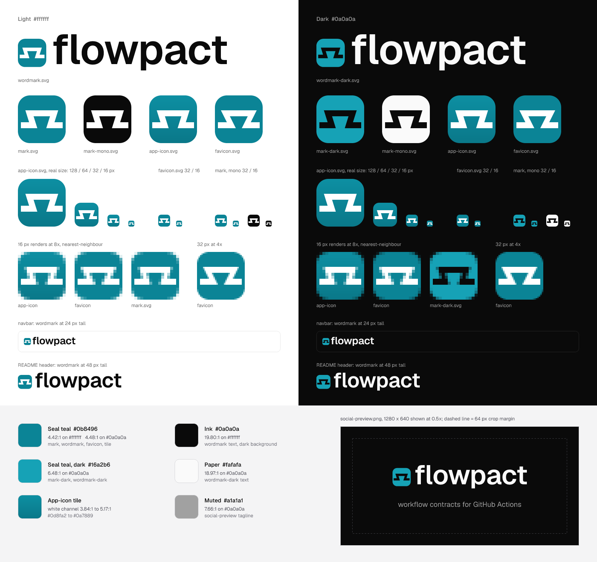

# flowpact brand: Keyed Seal

A rounded-square seal with one continuous channel cut through it: the data flow, which comes in at one side, rises over a dovetail key and goes out at the other. The key flares as it rises, so the two halves (caller and callee) fit together only one way, and the seal's rim holds them as one piece. That is what a locked workflow contract does.



## Colour

| Token | Hex | On `#ffffff` | On `#0a0a0a` | Used for |
|---|---|---|---|---|
| Seal teal | `#0b8496` | 4.42 : 1 | 4.48 : 1 | `mark.svg`, `wordmark.svg`, `favicon.svg` tile |
| Seal teal, dark | `#16a2b6` | 3.05 : 1 | 6.48 : 1 | `mark-dark.svg`, `wordmark-dark.svg` (dark backgrounds only) |
| Tile, top | `#0d8fa2` | 3.84 : 1 | 5.15 : 1 | `app-icon.svg` gradient |
| Tile, bottom | `#0a7889` | 5.17 : 1 | 3.83 : 1 | `app-icon.svg` gradient |
| Ink | `#0a0a0a` | 19.80 : 1 | n/a | wordmark text on light, dark background |
| Paper | `#fafafa` | n/a | 18.97 : 1 | wordmark text on dark |
| Muted | `#a1a1a1` | 2.58 : 1 | 7.66 : 1 | social-preview tagline |

The white channel in the app icon measures 3.84 : 1 to 5.17 : 1 against the gradient, and 4.42 : 1 against the flat teal in the favicon. `build.cjs` prints these ratios each time it runs.

On `#0a0a0a`, Seal teal measures 4.48 : 1, which passes but looks dim beside white text. The dark files use `#16a2b6` instead: the same hue (188°), lighter.

## Construction

- **Grid:** 64 units. The seal is the full square with a corner radius of 16.
- **Channel:** 8 units wide. It runs along rows 20–28 (over the key) and 36–44 (the side runs), so it is centred on the seal. Every horizontal edge is a multiple of 4, which puts it on a whole pixel row at 16 px.
- **Rim:** the channel stops 4 units from each side (32 on the 512 app icon). The seal stays one shape, and the white channel never reaches the edge of the tile.
- **Key:** 12 units wide at its base (y 44) and 22 at its crown (y 28). The walls lean 17.4°, and the inner corners are sharp (no fillets).
- **Favicon:** the same rows, with every key and socket corner moved onto a whole 16-px pixel. The key is 8 units wide at its base and 24 at its crown (walls at 26.6°), so at 16 px its sides step in by one pixel between its upper and lower rows. The master's 17.4° walls only blur at that size.
- **Wordmark:** lowercase "flowpact" in Geist SemiBold at −1 % tracking, converted to outlines and set at 1000 units per em. The mark is 0.672 em tall, and the channel's centre sits on the x-height midline (267 units above the baseline). The visible gap between the mark and the "f" is a quarter of the mark's height.

## Minimum sizes

| File | Minimum | Smaller than that |
|---|---|---|
| `mark.svg`, `mark-dark.svg`, `mark-mono.svg` | 24 px | use `favicon.svg` |
| `app-icon.svg` / PNGs | 32 px | use `favicon.svg` |
| `favicon.svg` | 16 px | n/a |
| `wordmark.svg`, `wordmark-dark.svg` | 24 px tall (the mark is then 19 px) | use the mark alone |

## Clear space

Keep a quarter of the mark's height (one corner radius) clear on every side of the mark, the app icon and the wordmark. Nothing else should sit in that space: no text, edges or other logos.

## Which file goes where

| Place | File |
|---|---|
| README header | `<picture>` with `wordmark-dark.svg` for dark mode and `wordmark.svg` as the ``, at `height="48"` (see below) |
| Docs favicon | `favicon.svg`, with `favicon-32.png` and `favicon-16.png` as PNG fallbacks |
| Docs navbar | `mark.svg` (light) or `mark-dark.svg` (dark) at 24 px beside the HTML site title, or the full `wordmark.svg` / `wordmark-dark.svg` at 24 px tall |
| VS Code Marketplace / Open VSX | `app-icon-256.png` as the extension's `icon` (for example, copied over `packages/vscode/icon.png`). It must be a PNG of at least 128 px; 256 stays sharp on HiDPI screens |
| npm | npm's README renderer may drop `<source>` and show only the ``, and it does not resolve repository-relative paths. Point that `` at an absolute `raw.githubusercontent.com` URL of `wordmark-light.png` |
| GitHub social preview | `social-preview.png` (1280 × 640), set in the repository's Settings → Social preview |
| Avatars (GitHub org, Open VSX publisher) | `app-icon-512.png` |
| Single-colour print, stamps, embossing | `mark-mono.svg` (it uses `currentColor`) |

README header (the repository README uses it from `assets/brand/`):

```html
<picture>
  <source media="(prefers-color-scheme: dark)" srcset="assets/brand/wordmark-dark.svg">
  
</picture>
```

The docs site uses `favicon.svg` and `favicon-32.png` as Next.js icons (`apps/docs/app/icon0.svg`, `icon1.png`),
`social-preview.png` as its Open Graph image, and draws the mark inline (`apps/docs/components/logo.tsx`, from
`mark-mono.svg`). The VS Code extension's `packages/vscode/icon.png` is `app-icon-256.png`.

## Don't

1. **Don't open the channel to the edges or crop the rim.** Without the rim, the seal falls apart into two shapes on white and on dark pages.
2. **Don't rotate, mirror or redraw the key.** Turned upside down, the key hangs like a tray. If the walls are made upright again, the mark reads as Π or a torii gate.
3. **Don't recolour the mark or add effects.** Use Seal teal, Seal teal dark or `mark-mono.svg` only. Don't add outlines or shadows, and don't use a gradient anywhere except the app icon. Don't place `mark.svg` on mid-tone or photographic backgrounds; use the mono mark there.

## Regenerating

`build.cjs` draws every SVG and PNG here, `sheet.png` included, from the geometry above. Its packages are not
project dependencies, so install them outside the repository:

```sh
npm i --prefix /tmp/flowpact-brand @resvg/resvg-js@2.6.2 opentype.js@2.0.0 geist@1.7.2
NODE_PATH=/tmp/flowpact-brand/node_modules node assets/brand/build.cjs
```

The output is byte-for-byte reproducible. `build.cjs` checks that no SVG contains `<text>`, filters, masks, images or external references, and that every coordinate is on the 0.5-unit grid. This file (`brand.md`) is written by hand.
