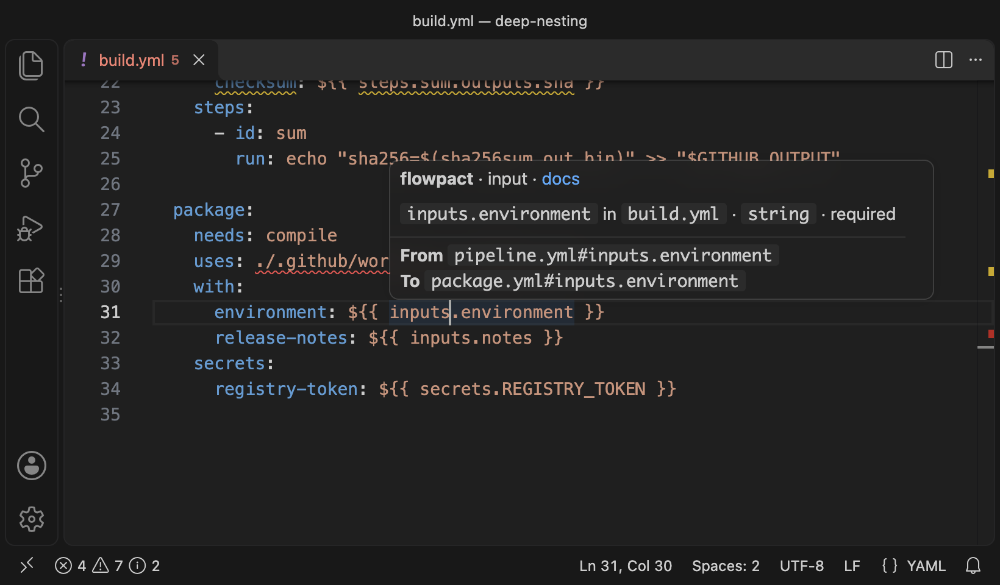
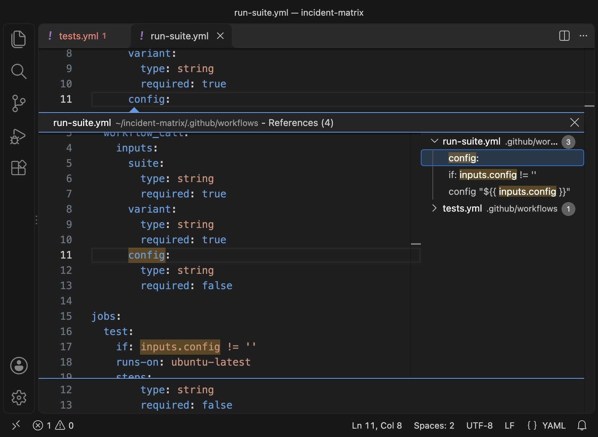

# flowpact for VS Code

GitHub Actions turns a missing matrix value, an undeclared secret or an optional input without a default into an empty value,
and the run stays green. [flowpact](https://rumankazi.github.io/flowpact) finds these across reusable workflows, local
actions and every combination of the matrices written in your workflows, and shows them as you type. It helps most when
your workflows call reusable workflows or local actions, or use `include` matrices.

## What it catches

- An input that is empty in some matrix combinations, because one `include` entry lacks the key it reads.
- A secret that a reusable workflow reads but never declares, so it is empty unless the caller passes `secrets: inherit`.
- Inputs that callers do not pass, outputs nothing reads, and `uses: ./` paths that do not exist where the step runs.

It works next to GitHub's GitHub Actions extension, which checks each file's syntax and expressions. By default, in
the files you open, flowpact hides its four checks that repeat that extension's (`FP502`–`FP505`), so nothing is
reported twice.

## Features

- **Diagnostics as you type** for the whole repository, closed files included. Editing a reusable workflow updates its
  callers' findings at once, before you save. Each finding links to its rule's documentation and shows the call chain
  that leads to it.
- **Hover** an input, secret, output, env variable or matrix key to see how it is declared, where its value comes from
  and where it flows, through every level of nesting.
- **Go to definition** across workflow calls and local actions: from `with: config:` to the callee's input, from
  `needs.build.outputs.url` to the reusable workflow's output, from `steps.x.outputs.y` to the action's output.
- **Find references** and **highlights** across files.
- **Contract drift** as you edit, when the repository [locks its contracts](https://rumankazi.github.io/flowpact/docs/contracts).

Your [flowpact config](https://rumankazi.github.io/flowpact/docs/configuration) applies as in the CLI and in CI:
severities, overrides, ignores and plugins.

## Also in CI

The same checks run in CI with `npx flowpact lint` (`npx flowpact check` adds contract drift) or the
[GitHub Action](https://github.com/marketplace/actions/flowpact) (`mode: check` for drift), which annotates pull
requests.

## Requirements

VS Code 1.101 or later. The analysis is bundled; nothing else needs to be installed.

## Settings

| Setting | Default | Description |
| --- | --- | --- |
| `flowpact.plugins` | `true` | Load the plugins the config lists. They run JavaScript from the repository, so they never load in an untrusted workspace. |
| `flowpact.contracts` | `auto` | Report contract drift: `auto` when `.github/flowpact/contracts/` exists, `on` or `off`. |
| `flowpact.overlappingRules` | `auto` | `FP502`–`FP505` repeat checks the GitHub Actions extension makes. `auto` hides them in files you open in the editor while that extension runs; `show` or `hide` them everywhere. |
| `flowpact.hiddenRules` | `[]` | Rule codes not to show in the editor. |
| `flowpact.trace.server` | `messages` | How much of each protocol message to show when the output's log level is Trace (`messages` or `verbose`). |

Logs go to the **flowpact** output channel; its log level (**Developer: Set Log Level…**) also sets the server's.

## Workspace trust

In Restricted Mode everything works except plugins. Trusting the workspace loads them without a restart. Plugins load
only for repositories inside the workspace folders.

## More

- [Editor documentation](https://rumankazi.github.io/flowpact/docs/editors), including other editors (`flowpact lsp`)
- [Rules](https://rumankazi.github.io/flowpact/docs/rules)
- [Issues](https://github.com/rumankazi/flowpact/issues)
